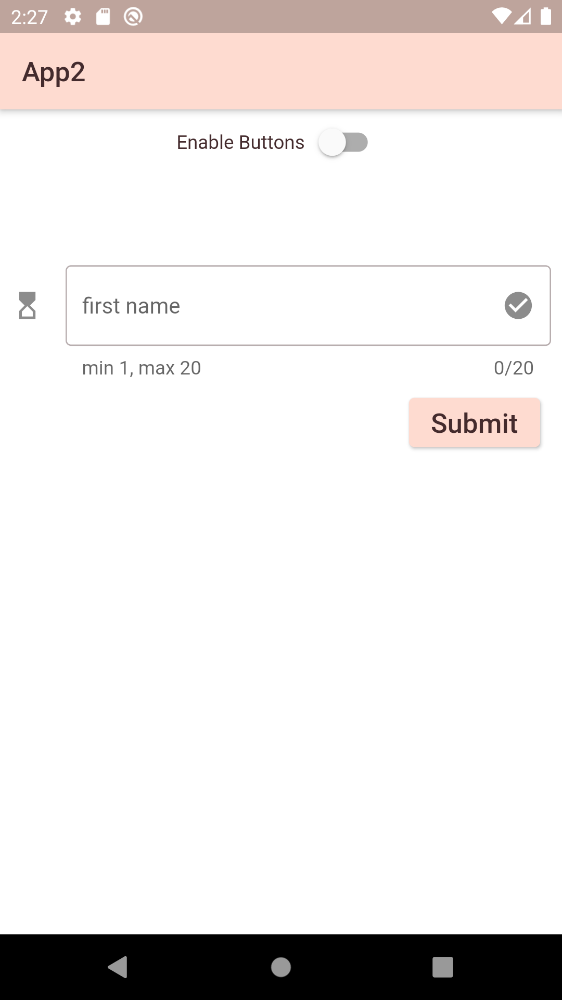
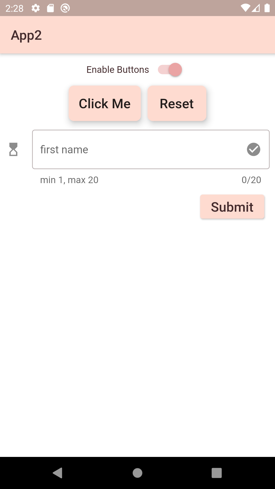
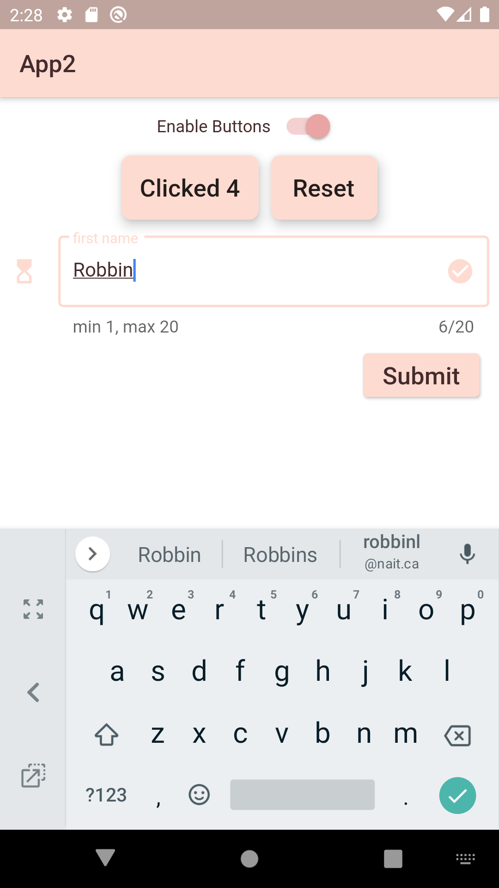
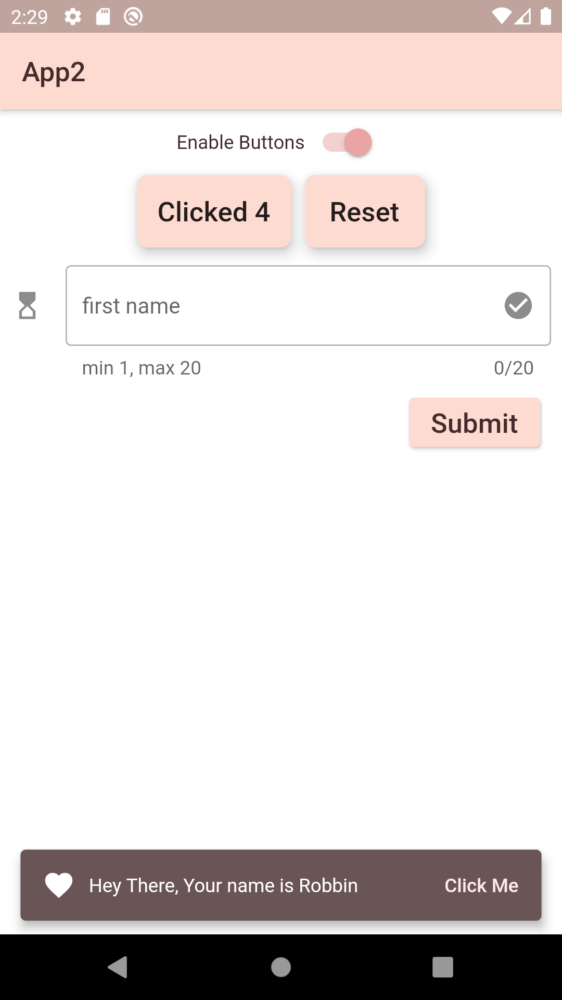

# Assignment 2: User Input

## Overview

The `start-kit` code given to you should compile and run as is, even though the functionality of the running app is not complete.

You will see `TODO` items in the given code, that directs where to put your code to complete the assessment. 

Commit your work and upload to a remote github repo and then submit the link to Moodle.

## Required Tasks

- Each `TODO:` comment will describe the expected functionality your code is to provide.

- Place your code immediately below the `TODO:` comment.

- `Do NOT change any of the code outside of a TODO: comment`.

### Part 1:

- Modify the following method of the `MyFirstPage` class in the `lib/first-page.dart` file:
  - `build()` to use a `switch` widget to control when two buttons are enabled or disabled.

- When the switch is off both buttons will be disabled and disappear.
 
- When the switch is on both buttons will appear and be functional.

- When the buttons are functional and the left one is clicked a counter will be incremented and the left buttons text will be updated to reflect the new count.
 
- If at any time the right button is clicked the left will reset the count and display `Click Me`.
 
- When the switch is turned back on the left button will display the count where it was before the switch was turned off.

### Part 2:

- Use a `textformfield` widget with validation to allow the user to enter a name between 1 and 10 characters. Wrap the `textformfield` in a `form` widget that has a Global Key to keep track of the state of the `form`.
- When the name is valid and the `Submit` button is pressed a `snackbar` will show in the bottom of the scaffold body for five seconds. 
- The `snackbar` will display the name typed into the `textformfield`.
- If the user clicks on the button in the snackbar a message will be printed to the console.

- Use the Shrine Pink theme that is provided.

## Sample Screen Shots
 

