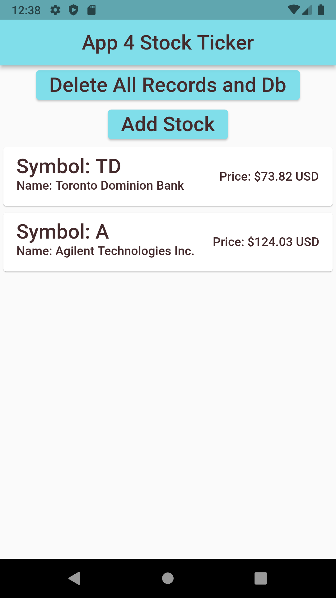

# Assignment 4: Stock Ticker

## Overview

The `start-kit` code given to you should compile and run as is, even though the functionality of the running app is not complete.

You will see `TODO` items in the given code, that directs where to put your code to complete the assessment. 

Commit your work and upload to a remote github repo and then submit the link to Moodle.

## Required Tasks

- Each `TODO:` comment will describe the expected functionality your code is to provide.

- Place your code immediately below the `TODO:` comment.

- `Do NOT change any of the code outside of a TODO: comment unless required`.

### Part 1:

- Modify methods of the `SQFliteDbService` class in the `services/db-service.dart` file as per the TODO comments in the file.
- Modify methods of the `StockService` class in the `services/stock-service.dart` file as per the TODO comments in the file.

### Part 2:

- Modify the following method of the `HomeView` class in the `views/home.dart` file:
  - `inputStock()` to insert a stock into the database when the `Add Stock` button is pressed.

## Sample Screen Shots
 

